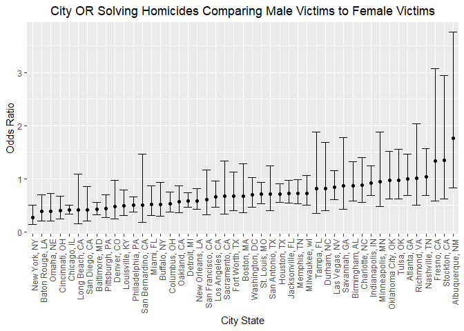
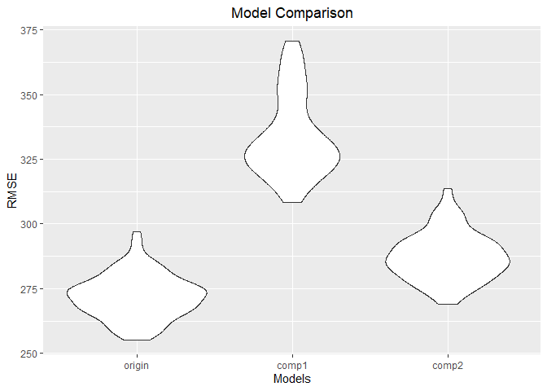

p8105_hw6_yy3307
================
2022-11-29

## Problem 1

## Problem 2

First we need to import and clean the `homicide` dataset. Then I’m going
to create a `city_state` variable as combination of `city` and `state`,
with a binary variable indicating whether the homicide is solved.
`victim_age` will be `mutate` as numeric expression. Dallas, TX;
Phoenix, AZ; Kansas City, MO; Tulsa, AL are being omitted and we only
focus our analysis on those for whom `victim_race` is `white` or
`black`.

``` r
homicide_raw = 
  read.csv("https://raw.githubusercontent.com/washingtonpost/data-homicides/master/homicide-data.csv") %>% 
  janitor::clean_names() %>% 
  mutate(
    city_state = str_c(city, ", ", state),
    solve_binary = as.numeric(
      ifelse(disposition == "Closed by arrest", 1, 0)
    ),
    victim_age = as.numeric(victim_age)
  ) %>% 
  filter(
    city_state != "Dallas, TX", 
    city_state != "Phoenix, AZ", 
    city_state != "Kansas City, MO", 
    city_state != "Tulsa, AL"
  ) %>% 
  filter(victim_race %in% c("White", "Black"))
```

Then I’m going to use the `glm` function to fit a logistic regression
with resolved vs unresolved as the outcome and victim age, sex and race
as predictors for city of Baltimore, MD. After applying `broom::tidy` to
it, we need to calculate the estimate and confidence interval.

``` r
baltimore_logistic =
  homicide_raw %>% 
  filter(city_state == "Baltimore, MD") %>% 
  glm(solve_binary ~ victim_age + victim_sex + victim_race, data = ., family = binomial()) %>% 
  broom::tidy() %>% 
  mutate(
    OR = exp(estimate),
    CI_upper = exp(estimate + 1.96 * std.error),
    CI_lower = exp(estimate - 1.96 * std.error)
  ) %>% 
  select(term, OR, CI_lower, CI_upper) %>% 
  knitr::kable(digits = 3)

baltimore_logistic
```

| term             |    OR | CI_lower | CI_upper |
|:-----------------|------:|---------:|---------:|
| (Intercept)      | 1.363 |    0.975 |    1.907 |
| victim_age       | 0.993 |    0.987 |    1.000 |
| victim_sexMale   | 0.426 |    0.325 |    0.558 |
| victim_raceWhite | 2.320 |    1.648 |    3.268 |

Now we are going to run the same process for each cities and extract
corresponding odds ratio and CI, but this time we will do it with a tidy
pipeline using `nest`, `unnest`, and `map`.

``` r
cities_logistic =
  homicide_raw %>% 
  nest(data = -city_state) %>% 
  mutate(
    models = map(data, ~glm(solve_binary ~ victim_age + victim_sex + victim_race, data = .x, family = binomial())),
    results = map(models, broom::tidy)) %>% 
  select(city_state, results) %>% 
  unnest(results) %>% 
  filter(term == "victim_sexMale") %>% 
  mutate(
    OR = exp(estimate),
    CI_upper = exp(estimate + 1.96 * std.error),
    CI_lower = exp(estimate - 1.96 * std.error)
  ) %>% 
  select(city_state, term, OR, CI_lower, CI_upper)

cities_logistic
```

    ## # A tibble: 47 × 5
    ##    city_state      term              OR CI_lower CI_upper
    ##    <chr>           <chr>          <dbl>    <dbl>    <dbl>
    ##  1 Albuquerque, NM victim_sexMale 1.77     0.831    3.76 
    ##  2 Atlanta, GA     victim_sexMale 1.00     0.684    1.46 
    ##  3 Baltimore, MD   victim_sexMale 0.426    0.325    0.558
    ##  4 Baton Rouge, LA victim_sexMale 0.381    0.209    0.695
    ##  5 Birmingham, AL  victim_sexMale 0.870    0.574    1.32 
    ##  6 Boston, MA      victim_sexMale 0.674    0.356    1.28 
    ##  7 Buffalo, NY     victim_sexMale 0.521    0.290    0.935
    ##  8 Charlotte, NC   victim_sexMale 0.884    0.557    1.40 
    ##  9 Chicago, IL     victim_sexMale 0.410    0.336    0.501
    ## 10 Cincinnati, OH  victim_sexMale 0.400    0.236    0.677
    ## # … with 37 more rows

The last step is to plot the estimated ORs and CIs for each city.
Confidence intervals are shown as `errorbar` in the plot.

``` r
city_plot = 
  cities_logistic %>% 
  mutate(city_state = fct_reorder(city_state, OR)) %>% 
  ggplot(aes(x = city_state, y = OR)) +
  geom_point() +
  geom_errorbar(aes(ymin = CI_lower, ymax = CI_upper)) +
  labs(
    title = "City OR Solving Homicides Comparing Male Victims to Female Victims",
    x = "City State",
    y = "Odds Ratio"
  ) +
  theme(
    axis.text.x = element_text(angle = 90, vjust = 0.7, hjust = 1),
    plot.title = element_text(hjust = 0.5)
  )

city_plot
```

<!-- -->

***Comments:***

From the plot we can analyze that the range for City OR Solving
Homicides Comparing Male Victims to Female Victims is from about 0.25 to
1.75. Generally odds ratio for most of the cities falls below 1. New
York, NY has the lowest odds ratio and Albuquerque, NM has the highest
odds ratio. We can also tell that the confidence interval for each city
does not follows a specific increasing trend, some cities may have low
OR with long CI and some may have high OR with shortter CI.

## Problem 3

The first step is to load and clean the data for regression analysis, we
need to convert numeric to factor and check for missing data. I would
use `as.factor` to change the numerics into factors.

``` r
birthweight_raw =
  read_csv("data/birthweight.csv") %>% 
  janitor::clean_names() %>%
  mutate(
    babysex = as.factor(babysex),
    frace = as.factor(frace),
    malform = as.factor(malform),
    mrace = as.factor(mrace)
  ) %>% 
  select(bwt, everything())

sum(is.na(birthweight_raw))
```

    ## [1] 0

``` r
birthweight_raw
```

    ## # A tibble: 4,342 × 20
    ##      bwt babysex bhead blength delwt fincome frace gaweeks malform menarche
    ##    <dbl> <fct>   <dbl>   <dbl> <dbl>   <dbl> <fct>   <dbl> <fct>      <dbl>
    ##  1  3629 2          34      51   177      35 1        39.9 0             13
    ##  2  3062 1          34      48   156      65 2        25.9 0             14
    ##  3  3345 2          36      50   148      85 1        39.9 0             12
    ##  4  3062 1          34      52   157      55 1        40   0             14
    ##  5  3374 2          34      52   156       5 1        41.6 0             13
    ##  6  3374 1          33      52   129      55 1        40.7 0             12
    ##  7  2523 2          33      46   126      96 2        40.3 0             14
    ##  8  2778 2          33      49   140       5 1        37.4 0             12
    ##  9  3515 1          36      52   146      85 1        40.3 0             11
    ## 10  3459 1          33      50   169      75 2        40.7 0             12
    ## # … with 4,332 more rows, and 10 more variables: mheight <dbl>, momage <dbl>,
    ## #   mrace <fct>, parity <dbl>, pnumlbw <dbl>, pnumsga <dbl>, ppbmi <dbl>,
    ## #   ppwt <dbl>, smoken <dbl>, wtgain <dbl>

From the counting `NA`s result shown above we can conclude that there is
actually no missing values in this dataset. However, we can observe that
almost for all data in `parity`, `pnumlbw`, `pnumgsa` are 0 and these
variables are not factor variables. We might consider if there was some
missing or input error in these variables with a large sample size even
these events are rare to happen.

Before making a regression model for birthweight, we need to decide
which variables are necessay and important for model hypothesis testing.
We can first fit regression using all predictors and select variables
using `backward` elimination to help us make valid selections.

``` r
mult_fit = 
  lm(bwt ~., data = birthweight_raw)

step(mult_fit, direction = 'backward')
```

    ## Start:  AIC=48717.83
    ## bwt ~ babysex + bhead + blength + delwt + fincome + frace + gaweeks + 
    ##     malform + menarche + mheight + momage + mrace + parity + 
    ##     pnumlbw + pnumsga + ppbmi + ppwt + smoken + wtgain
    ## 
    ## 
    ## Step:  AIC=48717.83
    ## bwt ~ babysex + bhead + blength + delwt + fincome + frace + gaweeks + 
    ##     malform + menarche + mheight + momage + mrace + parity + 
    ##     pnumlbw + pnumsga + ppbmi + ppwt + smoken
    ## 
    ## 
    ## Step:  AIC=48717.83
    ## bwt ~ babysex + bhead + blength + delwt + fincome + frace + gaweeks + 
    ##     malform + menarche + mheight + momage + mrace + parity + 
    ##     pnumlbw + ppbmi + ppwt + smoken
    ## 
    ## 
    ## Step:  AIC=48717.83
    ## bwt ~ babysex + bhead + blength + delwt + fincome + frace + gaweeks + 
    ##     malform + menarche + mheight + momage + mrace + parity + 
    ##     ppbmi + ppwt + smoken
    ## 
    ##            Df Sum of Sq       RSS   AIC
    ## - frace     4    124365 320848704 48712
    ## - malform   1      1419 320725757 48716
    ## - ppbmi     1      6346 320730684 48716
    ## - momage    1     28661 320752999 48716
    ## - mheight   1     66886 320791224 48717
    ## - menarche  1    111679 320836018 48717
    ## - ppwt      1    131132 320855470 48718
    ## <none>                  320724338 48718
    ## - fincome   1    193454 320917792 48718
    ## - parity    1    413584 321137922 48721
    ## - mrace     3    868321 321592659 48724
    ## - babysex   1    853796 321578134 48727
    ## - gaweeks   1   4611823 325336161 48778
    ## - smoken    1   5076393 325800732 48784
    ## - delwt     1   8008891 328733230 48823
    ## - blength   1 102050296 422774634 49915
    ## - bhead     1 106535716 427260054 49961
    ## 
    ## Step:  AIC=48711.51
    ## bwt ~ babysex + bhead + blength + delwt + fincome + gaweeks + 
    ##     malform + menarche + mheight + momage + mrace + parity + 
    ##     ppbmi + ppwt + smoken
    ## 
    ##            Df Sum of Sq       RSS   AIC
    ## - malform   1      1447 320850151 48710
    ## - ppbmi     1      6975 320855679 48710
    ## - momage    1     28379 320877083 48710
    ## - mheight   1     69502 320918206 48710
    ## - menarche  1    115708 320964411 48711
    ## - ppwt      1    133961 320982665 48711
    ## <none>                  320848704 48712
    ## - fincome   1    194405 321043108 48712
    ## - parity    1    414687 321263390 48715
    ## - babysex   1    852133 321700837 48721
    ## - gaweeks   1   4625208 325473911 48772
    ## - smoken    1   5036389 325885093 48777
    ## - delwt     1   8013099 328861802 48817
    ## - mrace     3  13540415 334389119 48885
    ## - blength   1 101995688 422844392 49908
    ## - bhead     1 106662962 427511666 49956
    ## 
    ## Step:  AIC=48709.53
    ## bwt ~ babysex + bhead + blength + delwt + fincome + gaweeks + 
    ##     menarche + mheight + momage + mrace + parity + ppbmi + ppwt + 
    ##     smoken
    ## 
    ##            Df Sum of Sq       RSS   AIC
    ## - ppbmi     1      6928 320857079 48708
    ## - momage    1     28660 320878811 48708
    ## - mheight   1     69320 320919470 48708
    ## - menarche  1    116027 320966177 48709
    ## - ppwt      1    133894 320984044 48709
    ## <none>                  320850151 48710
    ## - fincome   1    193784 321043934 48710
    ## - parity    1    414482 321264633 48713
    ## - babysex   1    851279 321701430 48719
    ## - gaweeks   1   4624003 325474154 48770
    ## - smoken    1   5035195 325885346 48775
    ## - delwt     1   8029079 328879230 48815
    ## - mrace     3  13553320 334403471 48883
    ## - blength   1 102009225 422859375 49906
    ## - bhead     1 106675331 427525481 49954
    ## 
    ## Step:  AIC=48707.63
    ## bwt ~ babysex + bhead + blength + delwt + fincome + gaweeks + 
    ##     menarche + mheight + momage + mrace + parity + ppwt + smoken
    ## 
    ##            Df Sum of Sq       RSS   AIC
    ## - momage    1     29211 320886290 48706
    ## - menarche  1    117635 320974714 48707
    ## <none>                  320857079 48708
    ## - fincome   1    195199 321052278 48708
    ## - parity    1    412984 321270064 48711
    ## - babysex   1    850020 321707099 48717
    ## - mheight   1   1078673 321935752 48720
    ## - ppwt      1   2934023 323791103 48745
    ## - gaweeks   1   4621504 325478583 48768
    ## - smoken    1   5039368 325896447 48773
    ## - delwt     1   8024939 328882018 48813
    ## - mrace     3  13551444 334408523 48881
    ## - blength   1 102018559 422875638 49904
    ## - bhead     1 106821342 427678421 49953
    ## 
    ## Step:  AIC=48706.02
    ## bwt ~ babysex + bhead + blength + delwt + fincome + gaweeks + 
    ##     menarche + mheight + mrace + parity + ppwt + smoken
    ## 
    ##            Df Sum of Sq       RSS   AIC
    ## - menarche  1    100121 320986412 48705
    ## <none>                  320886290 48706
    ## - fincome   1    240800 321127090 48707
    ## - parity    1    431433 321317724 48710
    ## - babysex   1    841278 321727568 48715
    ## - mheight   1   1076739 321963029 48719
    ## - ppwt      1   2913653 323799943 48743
    ## - gaweeks   1   4676469 325562760 48767
    ## - smoken    1   5045104 325931394 48772
    ## - delwt     1   8000672 328886962 48811
    ## - mrace     3  14667730 335554021 48894
    ## - blength   1 101990556 422876847 49902
    ## - bhead     1 106864308 427750598 49952
    ## 
    ## Step:  AIC=48705.38
    ## bwt ~ babysex + bhead + blength + delwt + fincome + gaweeks + 
    ##     mheight + mrace + parity + ppwt + smoken
    ## 
    ##           Df Sum of Sq       RSS   AIC
    ## <none>                 320986412 48705
    ## - fincome  1    245637 321232048 48707
    ## - parity   1    422770 321409181 48709
    ## - babysex  1    846134 321832545 48715
    ## - mheight  1   1012240 321998651 48717
    ## - ppwt     1   2907049 323893461 48743
    ## - gaweeks  1   4662501 325648912 48766
    ## - smoken   1   5073849 326060260 48771
    ## - delwt    1   8137459 329123871 48812
    ## - mrace    3  14683609 335670021 48894
    ## - blength  1 102191779 423178191 49903
    ## - bhead    1 106779754 427766166 49950

    ## 
    ## Call:
    ## lm(formula = bwt ~ babysex + bhead + blength + delwt + fincome + 
    ##     gaweeks + mheight + mrace + parity + ppwt + smoken, data = birthweight_raw)
    ## 
    ## Coefficients:
    ## (Intercept)     babysex2        bhead      blength        delwt      fincome  
    ##   -6098.822       28.558      130.777       74.947        4.107        0.318  
    ##     gaweeks      mheight       mrace2       mrace3       mrace4       parity  
    ##      11.592        6.594     -138.792      -74.887     -100.678       96.305  
    ##        ppwt       smoken  
    ##      -2.676       -4.843

From the result shown above, I’m going to select
`bwt ~ babysex + bhead + blength + delwt + fincome + gaweeks + mheight + mrace + parity + ppwt + smoken`
as hypothesis testing variables and propose a regression model for
birthweight based on these variables.

``` r
model_final =
  lm(bwt ~ babysex + bhead + blength + delwt + fincome + gaweeks + mheight + mrace + parity + ppwt + smoken, data = birthweight_raw)

model_final %>% 
  broom::tidy()
```

    ## # A tibble: 14 × 5
    ##    term         estimate std.error statistic   p.value
    ##    <chr>           <dbl>     <dbl>     <dbl>     <dbl>
    ##  1 (Intercept) -6099.      138.       -44.3  0        
    ##  2 babysex2       28.6       8.45       3.38 7.37e-  4
    ##  3 bhead         131.        3.45      37.9  3.10e-272
    ##  4 blength        74.9       2.02      37.1  4.29e-262
    ##  5 delwt           4.11      0.392     10.5  2.26e- 25
    ##  6 fincome         0.318     0.175      1.82 6.88e-  2
    ##  7 gaweeks        11.6       1.46       7.93 2.79e- 15
    ##  8 mheight         6.59      1.78       3.69 2.23e-  4
    ##  9 mrace2       -139.        9.91     -14.0  1.21e- 43
    ## 10 mrace3        -74.9      42.3       -1.77 7.68e-  2
    ## 11 mrace4       -101.       19.3       -5.21 1.98e-  7
    ## 12 parity         96.3      40.3        2.39 1.70e-  2
    ## 13 ppwt           -2.68      0.427     -6.26 4.20e- 10
    ## 14 smoken         -4.84      0.586     -8.27 1.75e- 16

After getting the fitted model for birthweight, we can make a plot of
model residuals against fitted values. First, we can use `add_residuals`
and `add_predictions` to find these values, then we just need to express
them as `grom_point`.

``` r
birthweight_raw %>% 
  add_residuals(model_final) %>% 
  add_predictions(model_final) %>% 
  ggplot(aes(x = pred, y = resid)) +
  geom_point() +
  labs(
    title = "Model Residuals Against Fitted Values",
    x = "Fitted value",
    y = "Residuals"
  ) +
  theme(plot.title = element_text(hjust = 0.5))
```

<!-- -->

Compare the model to two others using cross-validation:

One using length at birth and gestational age as predictors (main
effects only)

One using head circumference, length, sex, and all interactions
(including the three-way interaction) between these

Firstly, we need to fit the model for these variables under two
conditions.

``` r
comp1_model = 
  lm(bwt ~ blength + gaweeks, data = birthweight_raw) %>% 
  broom::tidy()

comp2_model = 
  lm(bwt ~ bhead + blength + babysex + bhead * blength + bhead * babysex + blength * babysex + bhead * blength * babysex, data = birthweight_raw) %>% 
  broom::tidy()
```

Then we can use cross-validation to compare the new model with our
previous fitted against residual model.

``` r
cv_df = 
  crossv_mc(birthweight_raw, 100) %>% 
  mutate(
    train = map(train, as_tibble),
    test = map(test, as_tibble)
  ) %>% 
  mutate(
    fit_origin = map(train, ~lm(bwt ~ babysex + bhead + blength + delwt + fincome + gaweeks + mheight + mrace + parity + ppwt + smoken, data = birthweight_raw)),
    fit_comp1 = map(train, ~lm(bwt ~ blength + gaweeks, data = birthweight_raw)),
    fit_comp2 = map(train, ~lm(bwt ~ bhead + blength + babysex + bhead * blength + bhead * babysex + blength * babysex + bhead * blength * babysex, data = birthweight_raw))
  ) %>% 
  mutate(
    rmse_origin = map2_dbl(fit_origin, test, ~rmse(model = .x, data = .y)),
    rmse_comp1 = map2_dbl(fit_comp1, test, ~rmse(model = .x, data = .y)),
    rmse_comp2 = map2_dbl(fit_comp2, test, ~rmse(model = .x, data = .y))
  )
```

The plot below shows the distribution of RMSE values for each model.

``` r
cv_df %>% 
  select(starts_with("rmse")) %>% 
  pivot_longer(
    everything(),
    names_to = "model", 
    values_to = "rmse",
    names_prefix = "rmse_") %>% 
  mutate(model = fct_inorder(model)) %>% 
  ggplot(aes(x = model, y = rmse)) + 
  geom_violin() +
  labs(
    title = "Model Comparison",
    x = "Models",
    y = "RMSE"
  ) +
  theme(plot.title = element_text(hjust = .5))
```

<!-- -->
